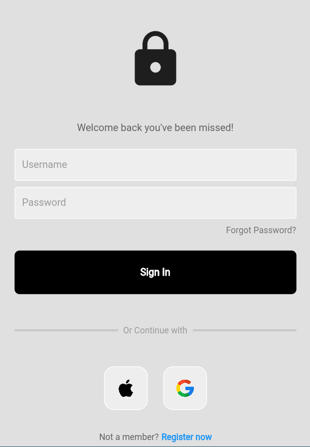
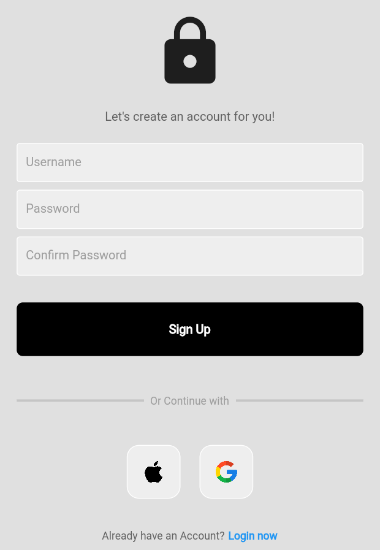
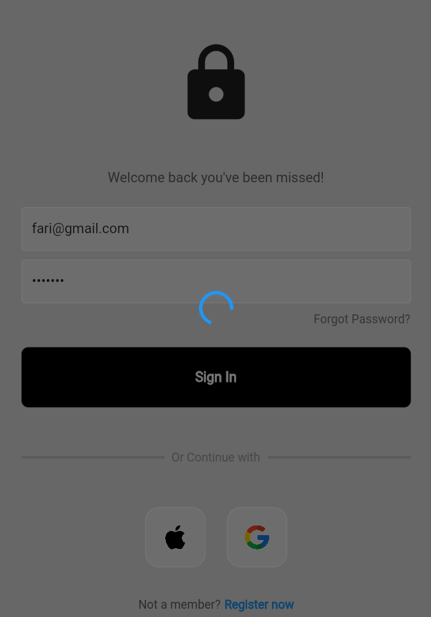
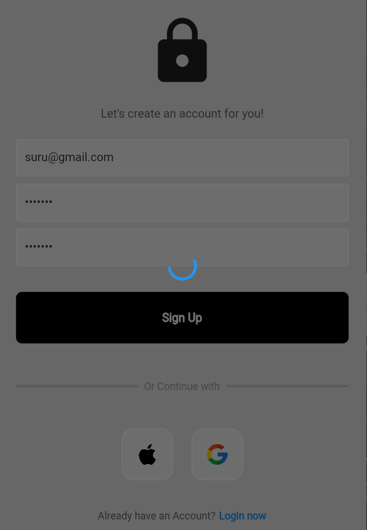
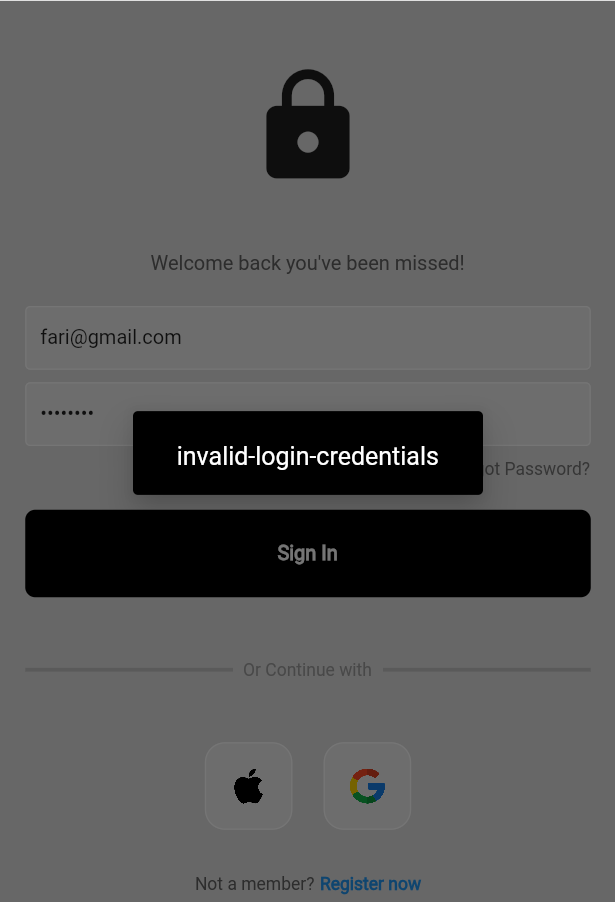
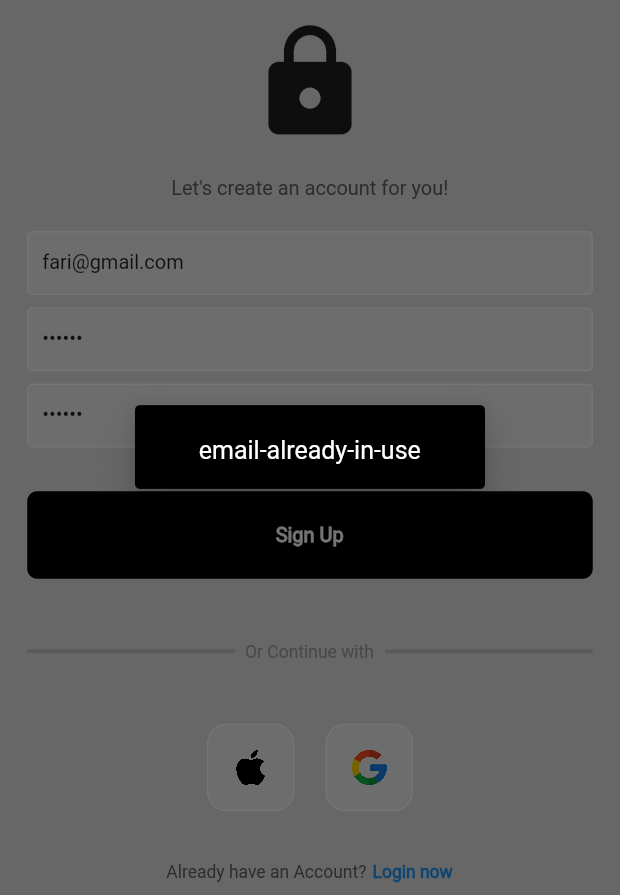

# firebase_loginout_auth
##Firebase Authentication
In this repository contains basic Firebase email and password Authentication  using Flutter.
##Screenshots

| Sign-In Screen | Sign-Up Screen |
|----------------|----------------|
|||
| Signing-In Screen | Signing-Up Screen|
|||
| HomePage After Sign-In Screen | HomePage After Sign-Up Screen |
|||
| Authentication On Sign-In Screen | Authentication On Sign-Up Screen |
|||

## Getting Started

This project is a starting point for a Flutter application.

A few resources to get you started if this is your first Flutter project:

- [Lab: Write your first Flutter app](https://docs.flutter.dev/get-started/codelab)
- [Cookbook: Useful Flutter samples](https://docs.flutter.dev/cookbook)

For help getting started with Flutter development, view the
[online documentation](https://docs.flutter.dev/), which offers tutorials,
samples, guidance on mobile development, and a full API reference.
